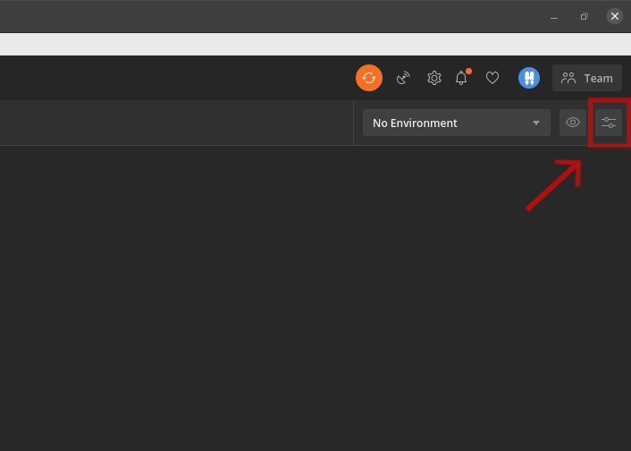
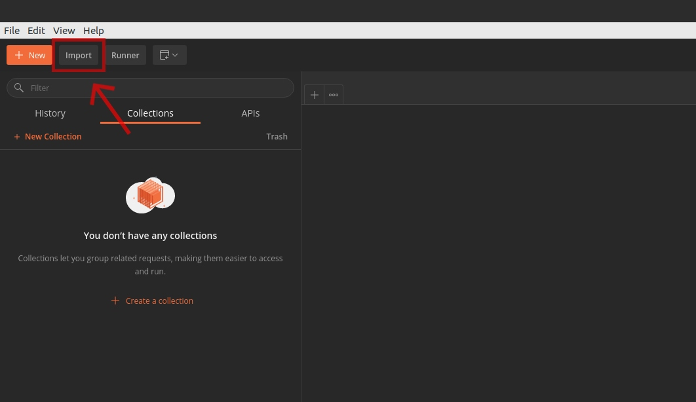

## Using AerisWeather API With Postman

A quick start guide to using the AerisWeather API with Postman. Check out our [official documentation](https://www.aerisweather.com/support/docs/api/) to discover the powerful features of our API.

### What You Need

- Access to [Postman](https://www.postman.com/) via web or desktop app.
- An [AerisWeather account](https://www.aerisweather.com/account/login/) with your client ID and client secret.

### Importing and Configuring Variables

Within the Postman application, import the `./AerisWeather API.postman_environment.json` file with the _Manage Environments_ button. Next, select the AerisWeather API environment and update the `CLIENT_ID`, `CLIENT_SECRET`, and `location` variables:

Now we can import the `./AerisWeather API.postman_collection.json` file with the *Import* option above the collection list. You are now ready to start hitting the AerisWeather API.

### Example Details

Be sure to check the request description for details about that request. The collection uses the following endpoints:

- [forecasts](https://www.aerisweather.com/support/docs/api/reference/endpoints/forecasts/)
- [conditions](https://www.aerisweather.com/support/docs/api/reference/endpoints/conditions/)
- [conditions/summary](https://www.aerisweather.com/support/docs/api/reference/endpoints/conditions-summary/)
- [airquality](https://www.aerisweather.com/support/docs/api/reference/endpoints/airquality/)
- [airquality/forecasts](https://www.aerisweather.com/support/docs/api/reference/endpoints/airquality-forecasts/)
- [phrases/summary](https://www.aerisweather.com/support/docs/api/reference/endpoints/phrases-summary/)
- [alerts](https://www.aerisweather.com/support/docs/api/reference/endpoints/alerts/)
- [tropicalcyclones](https://www.aerisweather.com/support/docs/api/reference/endpoints/tropicalcyclones/)
- [lightning](https://www.aerisweather.com/support/docs/api/reference/endpoints/lightning/)

Additionally, we include a prebuilt [batch request](https://www.aerisweather.com/support/docs/api/getting-started/batch/) which returns a single response containing a [places](https://www.aerisweather.com/support/docs/api/reference/endpoints/places/), conditions, hourly forecast, and 7-day forecast request.  Please note, the batch request will still use 4 API hits.

### Support

Feel free to reach out to our [Support Team](https://www.aerisweather.com/support/) if you have any additional questions.